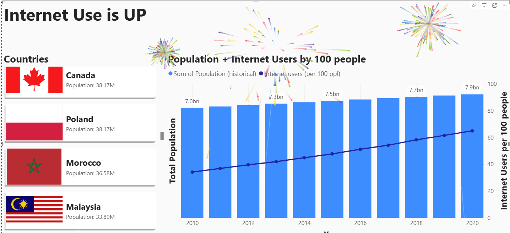

# PBI Particles

A lightweight implementation of tsParticles in Power BI, currently only supports [fireworks](https://particles.js.org/docs/modules/tsParticles_Fireworks_Bundle.html) currently, but is very easy to extend.

> This extension is merely meant as a demonstration of what is possible with Power BI, and not to meant to be taken seriously.
>> If you do use it in serious context, I would love to see the results though ;)
